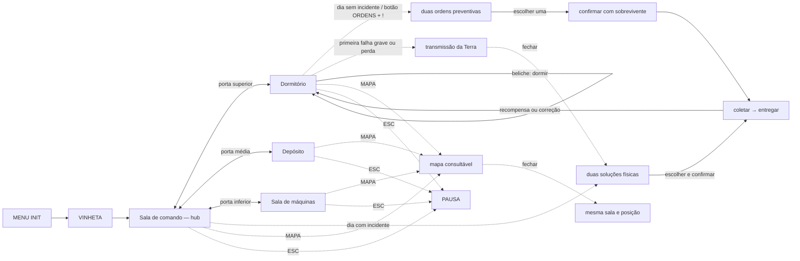

# Fluxo de telas

## Telas e como se chega

| Tela | Como se chega | O que mostra |
| --- | --- | --- |
| MENU INIT | ao abrir o jogo | título, campo do nome do técnico e botão de início |
| Vinheta | depois do INIT | 3 telas de texto, avançadas com clique |
| Sala de comando | depois da vinheta ou pelas portas do hub | cena 2D jogável, rota, comunicações, ordens e acessos por convés |
| Sala de máquinas | pela porta inferior do Comando | cena 2D jogável, motor, energia, suporte e ordens técnicas |
| Depósito | pela porta média do Comando | cena 2D jogável, estoques, componentes e ordens logísticas |
| Dormitório | pela porta superior do Comando e no início de cada novo dia | cena 2D jogável, descanso, saúde, moral, Neusa e ordens da tripulação |
| Ordens | botão `ORDENS`, sem abertura automática; `!` pulsante quando disponível | duas ordens preventivas comparáveis, com objeto, rota, recompensa e perda |
| Mapa | botão `MAPA` | sobreposição com posição, ordens ativas e problemas por sala; nunca transporta |
| Diálogo | interação com sobrevivente | retrato e caixa inferior; oferece ou confirma uma ordem |
| Incidente | no início dos dias 2, 4, 6, 8 e 10 | cartão modal com duas soluções físicas |
| Transmissão da Terra | primeira falha do motor, primeira chuva de meteoros e primeira perda | cartão modal com a mensagem; fecha com clique, `ENTER` ou `ESC` e não consome dia, tarefa ou recurso |
| Ajuda | botão `?` do rodapé | modal com as teclas e os botões do jogo |
| Pausa | ESC nas salas | continuar, reiniciar ou sair |
| Vitória | fim da viagem, com motor operante e sobrevivente vivo | ver [[MENU_VICTORY]] |
| Derrota | recurso crítico, motor destruído ou nenhum sobrevivente vivo | ver [[MENU_GAME_OVER]] |

## Grafo

## O ciclo do dia

1. O primeiro dia começa na Sala de comando; os seguintes, no Dormitório.
2. Nos dias sem incidente, o jogador começa livre na sala. O botão `ORDENS`
   mostra uma exclamação pulsante enquanto houver uma ordem disponível e nenhuma
   seleção ou quest em andamento. Círculo e exclamação geométrica crescem,
   mudam de cor e permanecem centralizados como um único selo. O jogador abre o
   cartão quando quiser; a seleção fica pendente até a confirmação presencial
   com o sobrevivente.
3. A confirmação presencial transforma a seleção em ordem aceita. Quando a origem
   coincide com o responsável (como em `V-02` e `N-02`), o sobrevivente entrega o
   objeto diretamente na mão do técnico e a etapa avança imediatamente para `ENTREGAR`.
   A ordem aceita não pode ser cancelada; a outra oferta expira.
4. Nos dias 2, 4, 6, 8 e 10, um incidente apresenta duas soluções físicas. O
   jogador escolhe e confirma uma no cartão; não existe contenção separada.
   Quando a transmissão da Terra dispara nesse dia, ela aparece antes do cartão:
   fechá-la revela as duas soluções.
5. A ordem ativa passa por `COLETAR` (quando originada em estação física) e `ENTREGAR`
   (ou diretamente `ENTREGAR` quando entregue em mãos pelo responsável). A coleta
   confirma o objeto e sua finalidade; a entrega confirma o resultado antes de aplicar.
6. Uma única quest pode ser concluída por dia. Somente o ponto da etapa atual
   permite interação: responsável da confirmação, origem da coleta ou destino.
7. Se nenhuma ordem preventiva for aceita, os dois recursos oferecidos sofrem
   pequenas perdas. Se a ordem aceita falhar, perde-se o recurso que ela
   protegeria; o objeto retorna à origem.
8. Se a solução de incidente falhar, o problema permanece ativo e segue sua
   perda, prazo e crise normais, sem multa adicional. A mesma solução reaparece
   como retomada enquanto o problema permanecer ativo.
Em um dia com incidente novo, o cartão desse incidente tem prioridade. A
retomada do problema anterior fica disponível no próximo dia sem incidente.
9. O técnico retorna ao próprio beliche no Dormitório. Dormir processa consumo,
   perdas, riscos, crises e condições de término.

O objetivo global continua sendo chegar a Marte com o motor operante e pelo
menos um sobrevivente vivo. A pressão diária vem da escolha entre duas ordens,
do custo dos seis recursos e da consequência de deixar uma necessidade sem
manutenção.

## Controles

| Ação | Tecla ou controle |
| --- | --- |
| Andar | ← → ou A/D |
| Correr | `Shift` com ← → ou A/D |
| Usar escada | ↑ ↓ ou W/S |
| Pular | espaço |
| Interagir e abrir portas | E |
| Continuar diálogos, confirmar modal e dormir | ENTER |
| Abrir o mapa | botão `MAPA`, com o mouse |
| Rever ofertas, ordem ativa e retomadas | botão `ORDENS`, com o mouse |
| Ver teclas e botões | botão `?`, com o mouse |
| Pausa, fechar/voltar modal e continuar na pausa | ESC |

O dia não avança por tecla ou botão persistente. Encerrá-lo exige chegar ao
beliche do técnico no Dormitório, conferir o resumo e dormir.

## Regras de navegação

- A Sala de comando continua sendo o hub e a topologia padrão continua em
  estrela, mas a navegação é dirigida pela tabela de portais: cada porta escolhe
  sala, destino e coordenadas próprias. Os pontos de interação de cada cômodo
  estão em [[ROOMS]].
- `door_x` e `door_y` posicionam a abertura em qualquer ponto do espaço da sala;
  `door_deck = -1` permite um limiar sem deck ou acima do piso. A interação usa
  proximidade horizontal e vertical ao limiar, não uma borda ou convés fixo.
- Na primeira travessia, o registro da própria porta define
  `door_arrival_x`, `door_arrival_y` e `door_arrival_facing`, permitindo chegada
  em qualquer canto ou convés válido. Ao retornar imediatamente para a sala
  anterior, o jogo reutiliza o `x/y` em que o técnico saiu; outros percursos
  usam a chegada padrão configurada.
- A composição espacial toma `COMMAND_ROOM_CONCEPT_ART.png` como referência,
  sem adotar nomes ou números ilustrativos da imagem.
- O mapa é uma sobreposição consultável. Marca `VOCÊ ESTÁ AQUI`, mostra a ordem
  ativa e os problemas por cômodo; clicar numa sala não move o técnico.
- Fechar o mapa retorna à mesma sala e à mesma posição.
- O HUD mostra na ordem ativa o estágio `COLETAR` ou `ENTREGAR`, além de
  responsável, objeto, origem, destino, recompensa e falha. Problemas ativos
  continuam mostrando perda, prazo e crise ([[HUD]]).
- Nos dias sem incidente, as oito ofertas do pool são filtradas para um par
  válido. As duas ordens são apresentadas remotamente; a escolhida só se torna
  aceita ao encontrar o sobrevivente responsável.
- Nos dias com incidente, o cartão apresenta duas soluções físicas. A solução
  escolhida substitui a contenção separada e deve ser executada no espaço
  jogável.
- O sobrevivente responsável pode ser origem ou destino da ordem. As rotas da
  matriz usam no máximo dois cômodos distintos; o casco parte do console da rota
  e termina no ponto sorteado.
- A coleta confirma o objeto e sua finalidade. A entrega confirma recompensa,
  custo, resultado ou problema resolvido antes de aplicar.
- Componentes e objetos só existem como parte de uma ordem aceita. O técnico
  carrega um por vez; não há coleta livre nem acúmulo de quests.
- Diagnóstico e conversa fora da ordem são opcionais. Não há cadeia universal de
  NPCs nem objetivo paralelo.
- Uma quest pode ser concluída por dia. A ordem aceita não pode ser cancelada.
- Antes do aceite, o botão `ORDENS` permite trocar a seleção preventiva. Depois
  do aceite, mostra apenas os detalhes da quest. Em dias sem incidente,
  `OFERTAS / PRÓXIMA RETOMADA` percorre as soluções dos problemas pendentes;
  a retomada exige confirmação e mantém a perda de negligência das preventivas.
- Uma ordem preventiva aceita e não concluída perde o recurso que protegeria e
  devolve o objeto à origem. A ordem não escolhida não gera perda.
- Se nenhuma ordem preventiva for aceita, os dois recursos das ofertas sofrem
  pequenas perdas. Se uma solução de incidente falhar, o problema permanece com
  suas perdas, prazo e crise normais, sem multa adicional.
- Pontos fora da etapa atual ficam apagados e não respondem a `E`; o selo de
  `ORDENS` é a única indicação persistente de uma oferta ou retomada disponível.

Os botões exibem no próprio rótulo o atalho de teclado que controla a ação:
`INICIAR (ENTER)`, `CONTINUAR (ENTER)`, `CONTINUAR (ESC)`, `CONFIRMAR (ENTER)`,
`ACEITAR ORDEM (ENTER)`, `ENTREGAR (ENTER)`, `ENCERRAR DIA (ENTER)`,
`VOLTAR (ESC)` e `FECHAR (ESC)`. Botões sem atalho de teclado permanecem
acionados pelo mouse.

## Referências

- [#5 Fluxo de telas e navegação](https://github.com/shelldonryan/gtd_example/issues/5)
- [#25 Redesenhar incidentes e ordens como quests físicas](https://github.com/shelldonryan/gtd_example/issues/25)
- [#27 Corrigir desfechos, transmissões e parametrizar portas, escadas, NPCs e HUD](https://github.com/shelldonryan/gtd_example/issues/27)
