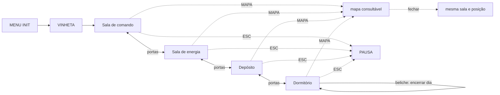

# Fluxo de telas

## Telas e como se chega

| Tela | Como se chega | O que mostra |
| --- | --- | --- |
| MENU INIT | ao abrir o jogo | título, campo do nome do técnico e botão de início |
| Vinheta | depois do INIT | 3 telas de texto, avançadas com clique |
| Sala de comando | depois da vinheta ou por uma porta | cena 2D jogável: console do briefing, rota, recursos e Vera |
| Sala de energia | por uma porta adjacente | cena 2D jogável: motor, reator, painel de economia e Sílvia |
| Depósito | por uma porta adjacente | cena 2D jogável: peças, kit de vedação, ponto do casco e Bento |
| Dormitório | por uma porta adjacente e no início de cada novo dia | cena 2D jogável: beliches, mesa comum, Neusa e beliche do técnico |
| Mapa | botão `MAPA` | sobreposição com a posição real do técnico e fichas consultáveis dos cômodos; nunca transporta o jogador |
| Diálogo | interação com sobrevivente | retrato sobre a cena e caixa inferior modal; avança com `ENTER` ou `CONTINUAR` |
| Evento | quando o dia abre | cartão modal sobre a sala atual, com o problema e duas alternativas |
| Pausa | ESC nas salas | continuar, reiniciar ou sair |
| Vitória | fim da viagem, com motor operante e sobrevivente vivo | ver `MENU_VICTORY.md` |
| Derrota | oxigênio, energia ou moral em zero, motor destruído ou nenhum sobrevivente vivo | ver `MENU_GAME_OVER.md` |

## Grafo

## O ciclo do dia

1. O primeiro dia começa na Sala de comando. Nos dias seguintes, o técnico
   começa no Dormitório e o evento aleatório abre como modal técnico sobre a
   sala. Ele mostra as duas consequências e bloqueia a exploração até a escolha.
2. O jogador responde ao evento; a resposta não gasta a tarefa do dia.
3. O técnico atravessa as portas até a Sala de comando e usa o console de
   briefing. O painel apresenta as tarefas disponíveis com custo, efeito e rota.
4. O jogador confirma uma tarefa. Nenhuma conversa inicia tarefa por acaso.
5. Uma orientação curta mostra apenas a próxima ação e o cômodo correspondente.
   Conversas, coletas e instalações atualizam essa instrução com termos concretos.
6. Somente a ação final cobra o custo e usa a tarefa do dia.
7. Para encerrar o dia, o técnico vai ao próprio beliche no Dormitório. Um resumo
   modal mostra consumo previsto, falhas ativas e tarefa concluída ou pendente.
8. Após a confirmação, recursos, moral e condições de término são processados;
   o novo dia começa no Dormitório.

## Controles

| Ação | Tecla ou controle |
| --- | --- |
| Andar | ← → ou A/D |
| Usar escada | ↑ ↓ ou W/S |
| Pular | espaço |
| Interagir e abrir portas | E |
| Continuar diálogos, confirmar briefing, confirmar modal e encerrar dia | ENTER |
| Abrir o mapa | botão `MAPA`, com o mouse |
| Pausa, fechar/voltar modal e continuar na pausa | ESC |

O dia não avança por tecla ou botão persistente. Encerrá-lo exige chegar ao
beliche do técnico no Dormitório e confirmar o resumo.

## Regras de navegação

- Os quatro cômodos são telas adjacentes. O técnico troca de cômodo somente ao
  atravessar uma porta; a posição de entrada corresponde à porta usada.
- O mapa é uma sobreposição consultável. Marca `VOCÊ ESTÁ AQUI`; clicar num
  cômodo abre sua ficha, mas não move nem define rota para o técnico.
- A ficha consultada mostra o destino final da tarefa ativa, quando houver. Ela
  não marca as salas intermediárias da rota.
- Fechar o mapa retorna à mesma sala e à mesma posição.
- O console de briefing da Sala de comando é a única origem da escolha diária.
  Ele apresenta custo, efeito e rota antes de confirmar.
- Depois da escolha, a interface mostra uma única próxima ação concreta, como
  `VÁ AO REATOR — SALA DE ENERGIA`.
- NPCs usam retrato e caixa inferior modal; o botão `CONTINUAR (ENTER)` avança
  o diálogo. Sistemas usam painel técnico sem retrato. Coletas e conclusões usam
  avisos breves; portas e escadas, indicações contextuais.

- Uma ação final consome a única tarefa do dia; movimento e etapas de preparação
  não consomem.
- A partir do dia 2, um evento aleatório abre como modal técnico sobre a sala,
  com o fundo ainda visível. Mostra as duas consequências antes da escolha e
  bloqueia movimento, mapa e outras interações até ser respondido.
- A pausa não consome tempo nem recursos.
- Tarefa não concluída não custa nada: o item continua com o técnico.
- O beliche do técnico no Dormitório abre o resumo e a confirmação de encerramento
  do dia; não existe mais o botão `Passar dia`.
- Transmissões da Terra aparecem na primeira ocorrência do incidente grave correspondente, mesmo quando o jogador neutraliza o incidente na hora. Cada tipo transmite uma vez por partida.
- O cartão de transmissão externa não consome a tarefa, a ação, recursos ou tempo. Ele é fechado com clique.
- Se uma transmissão e um evento do próximo dia coincidirem, a transmissão da consequência aparece primeiro; depois do clique, o evento abre.
- Marte só envia mensagem na vitória; ela fica incorporada à tela de vitória, sem um cartão adicional.

Os botões exibem no próprio rótulo o atalho de teclado que já controla a ação:
`INICIAR (ENTER)`, `CONTINUAR (ENTER)`, `CONTINUAR (ESC)`, `CONFIRMAR (ENTER)`,
`ENCERRAR DIA (ENTER)`, `VOLTAR (ESC)` e `FECHAR (ESC)`. Botões sem atalho de
teclado permanecem acionados pelo mouse.
