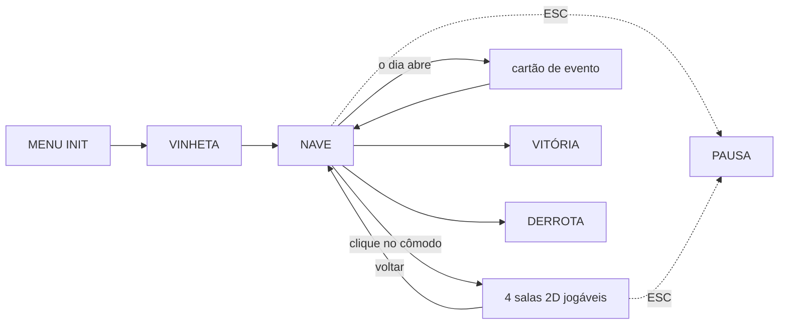

# Fluxo de telas

## Telas e como se chega

| Tela | Como se chega | O que mostra |
| --- | --- | --- |
| MENU INIT | ao abrir o jogo | título, campo do nome do técnico e botão de início |
| Vinheta | depois do INIT | 3 telas de texto, avançadas com clique |
| Nave | depois da vinheta e ao voltar de uma sala | mapa macro com os 4 cômodos clicáveis, HUD completo e rodapé |
| Sala de comando | clique no cômodo | cena 2D jogável: console do briefing, rota, recursos e Vera |
| Sala de energia | clique no cômodo | cena 2D jogável: motor, reator, painel de economia e Sílvia |
| Depósito | clique no cômodo | cena 2D jogável: peças, kit de vedação, ponto do casco e Bento |
| Dormitório | clique no cômodo | cena 2D jogável: beliches, mesa comum e Neusa |
| Evento | quando o dia abre | cartão sobre a tela atual, com o problema e duas alternativas |
| Transmissão externa | primeira falha do motor, primeira chuva de meteoros ou primeira perda de sobrevivente | cartão modal sobre a tela atual; fecha com clique |
| Pausa | ESC na nave ou nas salas | continuar, reiniciar ou sair |
| Vitória | fim da viagem, com motor operante e sobrevivente vivo | ver `MENU_VICTORY.md` |
| Derrota | oxigênio, energia ou moral em zero, motor destruído ou nenhum sobrevivente vivo | ver `MENU_GAME_OVER.md` |

## Grafo

## O ciclo do dia

1. O dia abre com o evento sorteado, em cartão sobre a tela da nave. O dia 1 não
   tem evento: nele o briefing da Vera faz o papel de tutorial.
2. O jogador escolhe uma das duas alternativas. **A resposta do evento não gasta
   a ação do dia.**
3. O jogador entra em um cômodo pelo mapa macro e percorre a **cadeia da
   tarefa**: conversar com o sobrevivente, coletar o item, instalar no lugar
   certo. Andar, pular, usar escada e cumprir os passos intermediários são
   livres.
4. A interação que **conclui** a tarefa cobra o custo e usa a única ação do dia.
5. "Passar dia": os recursos são consumidos, a moral é atualizada e o jogo
   verifica vitória e derrota.
6. O dia avança e o próximo evento é sorteado.

## Controles

| Ação | Tecla |
| --- | --- |
| Andar | ← → ou A/D |
| Usar escada | ↑ ↓ ou W/S |
| Pular | espaço |
| Interagir | E |
| Pausa | ESC |
| Passar dia e Voltar | botões do rodapé, com o mouse |

"Passar dia" é só com o mouse de propósito: é a ação que fecha o dia e não deve
acontecer por um Enter distraído.

## Regras de navegação

- A visão macro é o mapa geral: o clique só seleciona o cômodo e abre a cena
  correspondente.
- Dentro de cada cômodo, o técnico tem movimentação de plataforma básica: andar,
  pular, usar escadas, atravessar plataformas por baixo e interagir com os
  pontos do cômodo.
- Os pontos de interação e as oito tarefas de cada cômodo estão em
  `interface/ROOMS.md`.
- Uma interação concluída consome a única tarefa do dia; movimentar-se até ela e
  cumprir os passos intermediários não consome.
- Os sobreviventes ficam parados em pontos dos cômodos e são personagens
  interativos, sem rotinas autônomas nesta versão.
- Um evento por vez: o cartão bloqueia a exploração e as tarefas até ser
  respondido.
- A pausa não consome tempo nem recursos.
- O dia só avança pelo botão "Passar dia", nunca sozinho.
- Tarefa não concluída não custa nada: o dia vira normalmente e o item que o
  técnico carrega continua com ele.
- Transmissões da Terra aparecem na primeira ocorrência do incidente grave correspondente, mesmo quando o jogador neutraliza o incidente na hora. Cada tipo transmite uma vez por partida.
- O cartão de transmissão externa não consome a tarefa, a ação, recursos ou tempo. Ele é fechado com clique.
- Se uma transmissão e um evento do próximo dia coincidirem, a transmissão da consequência aparece primeiro; depois do clique, o evento abre.
- Marte só envia mensagem na vitória; ela fica incorporada à tela de vitória, sem um cartão adicional.
