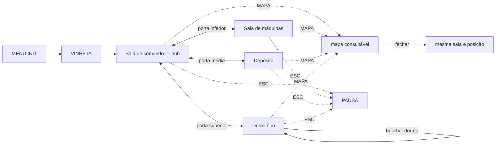

# Fluxo de telas

## Telas e como se chega

| Tela | Como se chega | O que mostra |
| --- | --- | --- |
| MENU INIT | ao abrir o jogo | título, campo do nome do técnico e botão de início |
| Vinheta | depois do INIT | 3 telas de texto, avançadas com clique |
| Sala de comando | depois da vinheta ou pelas portas do hub | cena 2D jogável: rota, comunicações, antena, acessos por convés e Vera |
| Sala de máquinas | pela porta inferior do Comando | cena 2D jogável: motor, energia, suporte de vida, economia e Sílvia |
| Depósito | pela porta média do Comando | cena 2D jogável: estoques, componentes especiais, racionamento e Bento |
| Dormitório | pela porta superior do Comando e no início de cada novo dia | cena 2D jogável: descanso, saúde, moral, Neusa e beliche do técnico |
| Mapa | botão `MAPA` | sobreposição com posição, problemas por sala e fichas consultáveis; nunca transporta o jogador |
| Diálogo | interação com sobrevivente | retrato sobre a cena e caixa inferior modal; avança com `ENTER` ou `CONTINUAR` |
| Incidente | em dias alternados | cartão modal sobre a sala atual; escolhe a contenção e cria um problema local persistente |
| Pausa | ESC nas salas | continuar, reiniciar ou sair |
| Vitória | fim da viagem, com motor operante e sobrevivente vivo | ver `MENU_VICTORY.md` |
| Derrota | oxigênio, energia ou moral em zero, motor destruído ou nenhum sobrevivente vivo | ver `MENU_GAME_OVER.md` |

## Grafo

## O ciclo do dia

1. O primeiro dia começa na Sala de comando; os seguintes, no Dormitório.
   Incidentes surgem em dias alternados.
2. Quando há incidente, o cartão apresenta duas contenções: gastar mais agora
   para ganhar segurança ou economizar e aceitar mais risco. A escolha não
   corrige a causa; cria um problema ativo no cômodo responsável.
3. O HUD destaca o problema com menor prazo. O mapa mostra todos os problemas,
   agrupados por sala, com perda diária, prazo e consequência da crise.
   Dano no casco fica associado ao cômodo que contém o local alcançável sorteado
   para aquela ocorrência.
4. O técnico escolhe a prioridade deslocando-se até os pontos relacionados.
   Não existe aceite de tarefa nem visita diária obrigatória ao Comando.
5. Diagnóstico, conversa, coleta de componente especial e ajuste de política são
   livres. Recursos comuns são pagos no ponto da intervenção.
6. Uma intervenção principal por dia conclui uma correção, recuperação ou
   aceleração. Os demais problemas permanecem ativos.
7. Para encerrar o turno, o técnico retorna ao próprio beliche no Dormitório.
   O resumo mostra consumo, perdas, prazos e a intervenção concluída ou ausente.
8. Dormir processa recursos, agravamentos, crises e condições de término. O novo
   dia começa no Dormitório.

## Controles

| Ação | Tecla ou controle |
| --- | --- |
| Andar | ← → ou A/D |
| Usar escada | ↑ ↓ ou W/S |
| Pular | espaço |
| Interagir e abrir portas | E |
| Continuar diálogos, confirmar modal e dormir | ENTER |
| Abrir o mapa | botão `MAPA`, com o mouse |
| Pausa, fechar/voltar modal e continuar na pausa | ESC |

O dia não avança por tecla ou botão persistente. Encerrá-lo exige chegar ao
beliche do técnico no Dormitório, conferir o resumo e dormir.

## Regras de navegação

- A Sala de comando é o único hub. Sua porta superior leva ao Dormitório, a
  média ao Depósito e a inferior à Sala de máquinas. As salas periféricas não
  possuem portas entre si.
- A composição espacial toma `COMMAND_ROOM_CONCEPT_ART.png` como referência,
  sem adotar nomes ou números ilustrativos da imagem.
- O mapa é uma sobreposição consultável. Marca `VOCÊ ESTÁ AQUI`; clicar num
  cômodo abre sua ficha, mas não move o técnico.
- O HUD mostra o problema com menor prazo e a quantidade dos demais. A ficha de
  cada sala mostra todos os problemas locais, suas perdas, prazos e crises.
- Fechar o mapa retorna à mesma sala e à mesma posição.
- Problemas já nascem ativos após o incidente. Os pontos relacionados respondem
  imediatamente; não existe tarefa a aceitar no Comando.
- Dano no casco não possui estação fixa: cada ocorrência ativa um local
  alcançável sorteado em qualquer um dos quatro cômodos.
- NPCs usam retrato e caixa inferior modal. Sistemas usam painel técnico sem
  retrato. Coletas e conclusões usam avisos breves; portas e escadas, indicações
  contextuais.
- Uma correção, recuperação ou aceleração consome a intervenção principal do
  dia. Movimento, diagnóstico, conversa, componente especial e políticas não.
- A sequência contém somente passos necessários ao problema; NPC e troca de
  cômodo não são requisitos universais.
- Recursos comuns são pagos no ponto final. Apenas componentes especiais
  precisam ser buscados fisicamente no Depósito.
- Incidentes surgem em dias alternados e não repetem um problema ainda ativo.
  O cartão bloqueia a exploração até a contenção ser escolhida.
- A pausa não consome tempo nem recursos.
- O beliche do técnico abre o resumo e a confirmação para dormir; não existe
  botão `Passar dia`.
- Transmissões da Terra aparecem na primeira ocorrência do incidente grave
  correspondente, mesmo quando o jogador escolhe a contenção mais segura. Cada
  tipo transmite uma vez por partida.
- O cartão de transmissão externa não consome intervenção, recurso ou tempo.
  Se coincidir com um incidente, a transmissão anterior aparece primeiro.
- Marte só envia mensagem na vitória; ela fica incorporada à tela de vitória, sem um cartão adicional.

Os botões exibem no próprio rótulo o atalho de teclado que já controla a ação:
`INICIAR (ENTER)`, `CONTINUAR (ENTER)`, `CONTINUAR (ESC)`, `CONFIRMAR (ENTER)`,
`ENCERRAR DIA (ENTER)`, `VOLTAR (ESC)` e `FECHAR (ESC)`. Botões sem atalho de
teclado permanecem acionados pelo mouse.
